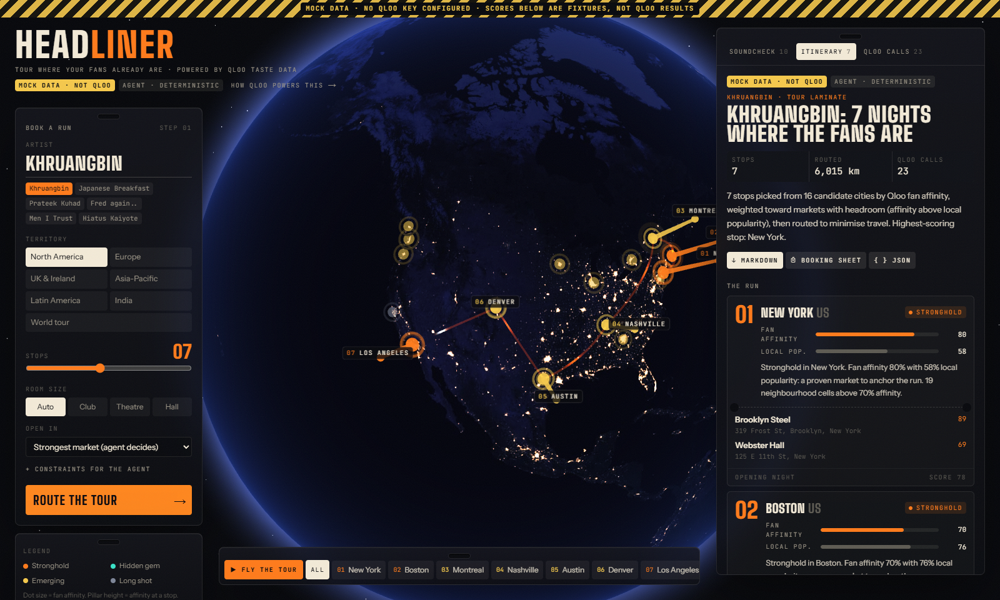

# Headliner

**Tour where your fans already are.** Headliner is a booking agent for independent artists, built on
[Qloo](https://www.qloo.com/) taste data. Give it an artist and a territory. It reads Qloo's heatmap of
where that artist's audience ranks highest, picks the cities (including the overlooked ones), the rooms
that crowd already goes to, the acts and brands they share taste with, and an aggregate audience brief.
Then it routes the run on a night-lights globe and exports a booking sheet.

**Live demo: [headliner-five.vercel.app](https://headliner-five.vercel.app)** · built for the
[Qloo Agentic Hackathon](https://qloo.devpost.com/) · [how Qloo powers it](https://headliner-five.vercel.app/how)



## What it finds

Booking agents route first tours on gut feel and last tour's ticket counts, and neither exists for a
new territory. Qloo can show where an audience over-indexes before a single ticket is sold. A few
results from live Qloo data:

- **Khruangbin, North America.** San Francisco, Portland and Austin lead, as you would expect. The
  surprise is Burlington, Vermont: fans rank in the top 0.8% of the continent while its market sits
  lower (popularity 0.976), so it reads as a hidden gem. Missoula and Santa Fe do the same.
- **AP Dhillon, North America.** The run comes out all-Canadian (Toronto, Winnipeg, Edmonton, Calgary,
  Vancouver, Victoria), and the strongest cells sit 20 to 25 km outside Toronto and Vancouver, toward
  Brampton and Surrey. His bill is Diljit Dosanjh, Karan Aujla and Sidhu Moose Wala.
- **Prateek Kuhad, India.** Goa, Mumbai, Pune, Bengaluru, Kolkata and Shillong, with The Local Train,
  Tajdar Junaid and The Yellow Diary on the bill and the Royal Opera House Mumbai as a theatre room.
- **Sanity check.** Morgan Wallen's audience peaks in Nashville (0.994) and drops to 0.49 in San
  Francisco. The signal is taste geography, not population.

## How a run works

Each step streams to the **Soundcheck** timeline; the **Qloo calls** tab lists every request with its
parameters, timing, result count and whether it came from cache. The key never leaves the server.

| # | Tool | Qloo request |
| --- | --- | --- |
| 1 | Resolve the artist | `GET /search?query=…&types=urn:entity:artist` |
| 2 | Room categories | `GET /v2/tags?filter.query=live music venue&feature.semantic_search=true` |
| 3 | Score every city | `GET /v2/insights?filter.type=urn:heatmap&signal.interests.entities=<artist>&filter.location=POLYGON(…)` (one call per territory) |
| 4 | Match rooms | `filter.type=urn:entity:place` + `filter.location.query=<city>` + `filter.tags=<room categories>` |
| 5 | Neighbourhood hotspots | `filter.type=urn:heatmap` + `filter.location.query=<city>` |
| 6 | Build the bill | `filter.type=urn:entity:artist` + `filter.exclude.entities` + a popularity band (+ `signal.demographics.age` for a younger crowd) |
| 7 | Brand partners | `filter.type=urn:entity:brand` |
| 8 | Audience brief | `filter.type=urn:demographics` and `filter.type=urn:tag` + `filter.tag.types` + `diversify.by=subtype` |

Steps 1 to 4 and 6 to 8 run as a research pass. An LLM (gpt-oss-120b on Groq, falling back to
gpt-oss-20b and Qwen, through tool calling) then gets a compact evidence digest with Qloo IDs swapped for
short aliases. It picks the cities, rooms, bill and brands, and can call `find_venues` (with a room type)
or `similar_artists` before it calls `submit_tour_plan`. The server then checks the draft: every ID must
exist in the evidence, the stop count and start city must match, every number cited in a stop reason
must be that stop's own Qloo number, and any "hidden gem" or "stronghold" label must match its computed
read. A failing draft goes back once for correction; after that the server drops anything unsupported,
fills every figure from the evidence ledger, writes the demographic facts itself, routes the stops
(nearest neighbour plus 2-opt, trying every opener) and validates the plan with zod. If the LLM is
unavailable the deterministic planner finishes the same evidence, and the plan says so.

## Reading the numbers

A Qloo heatmap's affinity and popularity are percentiles across every cell in the queried area, so
big cities crowd the top: every primary North American market sits between 0.88 and 1.0. Headliner
reads both on a log scale of how far into the top a city sits (top 0.1% → 0.98, top 1% → 0.85, top 3%
→ 0.70, median → 0.15) and compares the fan rank with the popularity rank.

| Read | Rule (Headliner's interpretation, not a Qloo metric) |
| --- | --- |
| Hidden gem | fans in the top 3% of the territory and clearly ahead of the local market (headroom ≥ 0.05) |
| Stronghold | fans in the top 1% |
| Emerging | fans in the top 7% |
| Long shot | everything else |

The thresholds were calibrated on live heatmaps for 12 artists across all six territories
(Khruangbin, Prateek Kuhad, Fred again.., Peggy Gou, AP Dhillon, Morgan Wallen, Bad Bunny, Japanese
Breakfast, Arlo Parks, Mdou Moctar, Anoushka Shankar, Men I Trust). Mainstream acts get no hidden
gems, which is the honest answer. The stop score is 80% fan concentration and 20% headroom.

## What building on the API taught us

- `output.heatmap.boundary=urn:entity:locality` returned a 500 on the hackathon host for every area we
  tried, so cities are read from geohash cells (about 40 km) at their centres instead.
- A text query like "Europe" resolves to no cells. WKT polygons cover multi-country territories;
  India works as a country query.
- `take` is ignored for heatmaps; a territory call returns thousands of cells.
- Some city names (Shillong) do not resolve as localities, so those calls retry with a 20 km WKT point.
- Place results carry `query.localities.filter[0].disambiguation`, which Headliner shows as proof of
  which Portland it searched.
- Explainability is 1.0 with a single signal and splits almost evenly across a multi-artist bill, so
  Headliner treats it as provenance rather than insight.
- The hackathon key allows 5 requests per second and 10,000 per month. The client spaces requests,
  shares identical in-flight calls, caches packed responses for a week (memory, then Vercel Runtime
  Cache), and replays an identical run for 7 days. A full uncached run costs about 25 calls.

## Run it

Requires Node 22+ and pnpm 10.

```bash
pnpm install
cp .env.example .env.local   # add QLOO_API_KEY and GROQ_API_KEY (or OPENAI_API_KEY)
pnpm dev                     # http://localhost:3000
```

| Script | What it does |
| --- | --- |
| `pnpm test` | vitest: scoring, city reads, hydration and anti-hallucination checks, routing, mapping on live payload shapes, HTTP client, caching, mock transport |
| `pnpm typecheck` / `pnpm lint` / `pnpm build` | the usual |
| `pnpm verify:qloo [artist]` | hits every Qloo call Headliner makes with the real key and prints shapes (about 12 calls) |
| `pnpm eval:llm [url] [runs]` | runs 10 artist/territory/constraint cases through `/api/plan` and scores validity, latency and tokens |
| `pnpm warm [url] [--fresh]` | pre-runs the one-click demos so visitors get instant replays |
| `pnpm shots [url]` | regenerates `shots/` from a running instance (local Chrome, headless) |

All variables are server-side only; none are `NEXT_PUBLIC_`. See [`.env.example`](.env.example). Without
`QLOO_API_KEY` the app runs on clearly labelled mock fixtures; without an LLM key the deterministic
planner runs on its own.

## Project layout

```text
src/lib/qloo/        typed client: HTTP transport (throttle, cache tiers, quota guard), mapping, mock transport
src/lib/agent/       tools, evidence ledger, LLM orchestrator, deterministic planner, run replay
src/lib/plan/        zod schemas, hydration, scoring and routing, Markdown export
src/lib/cities.ts    185 candidate markets in six territories, plus the territory polygons
src/components/      globe (React Three Fiber + custom shaders), control deck, timeline, itinerary, print sheet
src/app/api/plan     POST → NDJSON stream of agent events
```

## Limits

- Scores are Qloo **aggregate** taste affinities for audiences in a place. They are not ticket-sales
  forecasts and never describe an individual. No personal data is sent to Qloo.
- The labels and the score are Headliner's interpretation of Qloo numbers.
- Qloo has no venue capacities, so room size is a place-category filter. Availability, capacity, routing
  days and visas still need a human agent.
- The city catalogue is curated (185 markets). A city between catalogue entries is only visible as glow
  on the globe.
- The free Groq tier allows 200K tokens a day per model; when that runs out, plans come from the
  deterministic planner and say so.

## Credits

- Taste data: [Qloo](https://www.qloo.com/) Insights API (hackathon tier).
- Earth at night: NASA Earth Observatory, **Black Marble 2016** (public domain). See
  [`public/textures/ATTRIBUTION.md`](public/textures/ATTRIBUTION.md).
- Fonts: Big Shoulders, Instrument Sans and JetBrains Mono (SIL OFL, via Google Fonts). Icons: Phosphor.

## License

[MIT](LICENSE) © 2026 Prasenjit Nayak
